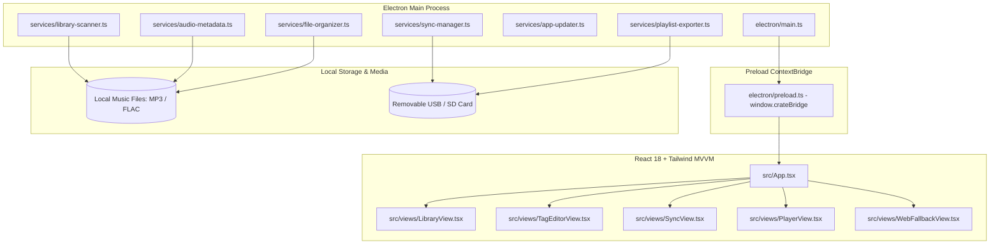

# Crate - System Architecture Target

## Overview

Crate is a specialized desktop audio management and car synchronization tool built on Electron, React 18, TypeScript, and Tailwind CSS. It empowers audiophiles and music enthusiasts to organize personal music collections, curate tags directly in local audio files, format folder and playlist structures for car head units, and perform incremental delta synchronization to removable USB/SD storage.

## Core Subsystems

### 1. Electron Main & IPC Security Boundary
- **Process Isolation**: The main process executes with `contextIsolation: true`, `nodeIntegration: false`, and `sandbox: true`.
- **ContextBridge**: The renderer communicates exclusively via typed asynchronous IPC handlers exposed on `window.crateBridge`. Direct filesystem or process execution is completely inaccessible to renderer scripts.
- **Undocked Secondary Window**: When undocked, a secondary Frameless Electron window is instantiated for media controls. State is synchronized bi-directionally across windows via IPC events (`player:state-change`, `player:command`).

### 2. Audio Metadata & Tagging Engine
- **In-Place Modification**: Edits are written directly to audio file headers (`ID3v2.3`/`ID3v2.4` for MP3, Vorbis Comments for FLAC) using native binary parsers.
- **Tag Preservation**: Existing non-edited tags (BPM, ReplayGain, custom comments) are preserved untouched during save operations.
- **Embedded Artwork**: APIC frames and PICTURE blocks are extracted as base64/blob URIs for viewing and replaced atomically upon user update.
- **Zero-Network Policy**: In compliance with `REQ-TAG-003`, all tagging and indexing operations run strictly offline without outbound telemetry or network API lookups. The update check (subsystem 6) is the only background network request and sends no library data.

### 3. Filesystem Organizer & Car Head Unit Formatter
- **Pattern Layout**: Generates deterministic hierarchy `<Artist>/<Album>/<Track#> <Title>.<ext>` or `<Artist>/<Album>/Disc <N> <Track#> <Title>.<ext>` for multi-disc sets.
- **FAT32 / exFAT Sanitization**: Strips or replaces reserved filesystem characters (`: * ? " < > | \ /`) and trims trailing periods/spaces to ensure flawless parsing by car firmware.
- **Playlist Export**: Generates `.m3u` playlists with relative paths from the target root and strict `\r\n` (CRLF) line terminators matching automotive firmware specifications.

### 4. Incremental Car Sync Engine
- **Delta Analysis**: Scans destination USB/SD card directory and computes changes based on relative path, file size, and modification timestamp.
- **Selective Scoping**: Supports synchronizing the entire library, selected playlists, or curated albums.
- **Stale Track Pruning**: Identifies files on the removable drive that are no longer part of the sync selection and offers one-click cleanup.

### 5. Web Distribution Shell
- A lightweight static containerized portal served on Foundry (`crate.chaos-architect.dev`) providing honest desktop prerequisite guidance, SmartScreen bypass documentation, and direct portable executable downloads with SHA-256 verification.

### 6. In-App Updates
- **Feed**: Installed builds read updates from a separate public `crate-releases` repository, because the source repository is private and an installed app cannot authenticate to it. CI publishes the Setup installer, its blockmap, and `latest.yml` there after each release.
- **Lifecycle**: `services/app-updater.ts` checks shortly after launch and every 6 hours, downloads in the background, and installs on quit. Once a download finishes the UI offers a non-blocking "Restart to update" prompt; "Later" still installs on quit.
- **Scope**: Unpackaged runs and the portable build never self-update. The status reaches the renderer through the `window.crateBridge` update methods.

## Architectural Decision Records (ADRs)

- [ADR-001: Standalone Electron Desktop Runtime with ContextBridge IPC](file:///d:/code-repos/crate/docs/adrs/ADR-001-desktop-runtime.md)
- [ADR-002: Direct In-File Audio Metadata Tagging](file:///d:/code-repos/crate/docs/adrs/ADR-002-metadata-tagging.md)
- [ADR-003: Deterministic Car-Compatible Filesystem Layout and Sanitization](file:///d:/code-repos/crate/docs/adrs/ADR-003-filesystem-organization.md)
- [ADR-004: Incremental Delta Car Synchronization Engine](file:///d:/code-repos/crate/docs/adrs/ADR-004-car-sync-engine.md)
- [ADR-005: Multi-Window Audio Player Undocking via IPC State Broadcasting](file:///d:/code-repos/crate/docs/adrs/ADR-005-multi-window-player.md)
- [ADR-006: In-App Updates from a Public Releases Repository](file:///d:/code-repos/crate/docs/adrs/ADR-006-auto-update.md)
